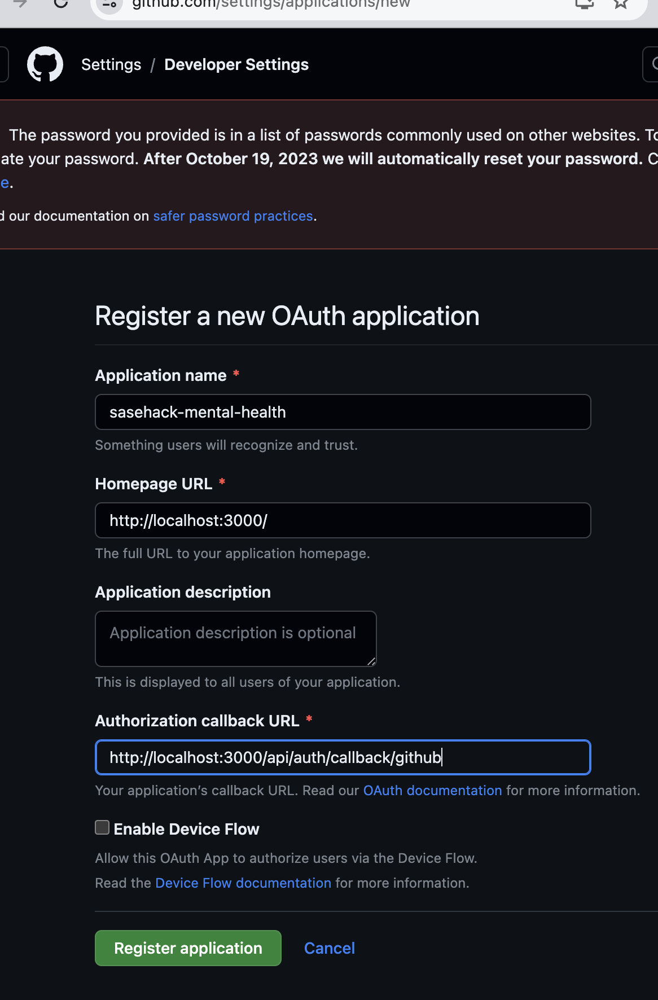

## Getting Started

```bash
npm run dev
# or
yarn dev
# or
pnpm dev
# or
bun dev


```

### Authenticating Details

Generating Random Open SSL
```bash

openssl rand -base64 32
hp6ViVkd4+efqn1j1rKOOGTVv3Cq6nYraZp3WQXirwU=

```




- Remmeber to update on deployment

Client Id | Secret
```
df0e3352d6d3c2aa5aae
ae777c63f969cc3825d43caaba58023bf6401567
```

## Credits:


Meme API https://meme-api.com/gimme

Semantic UI

Changes ong github oath callbacks

```
http://localhost:3000/api/auth/callback/github
https://nenewang.github.io/sase_frontend/api/auth/callback/github

```


